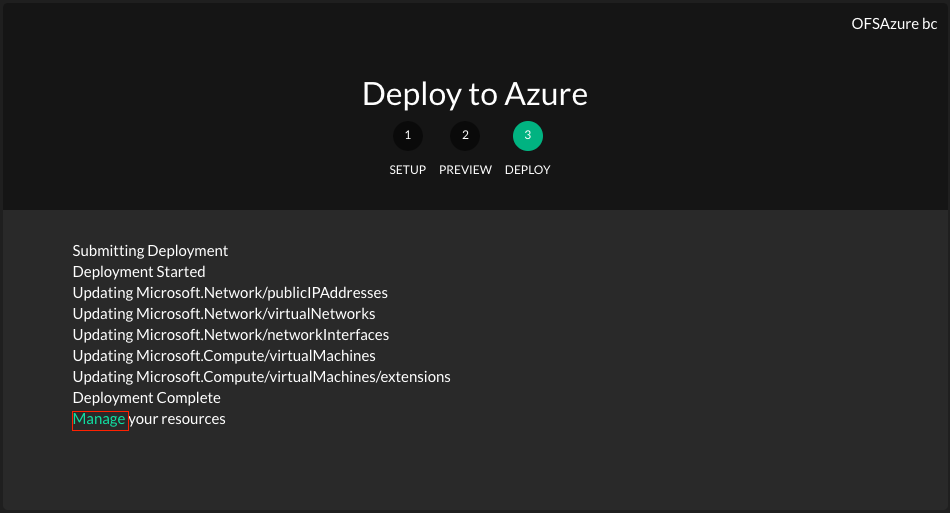
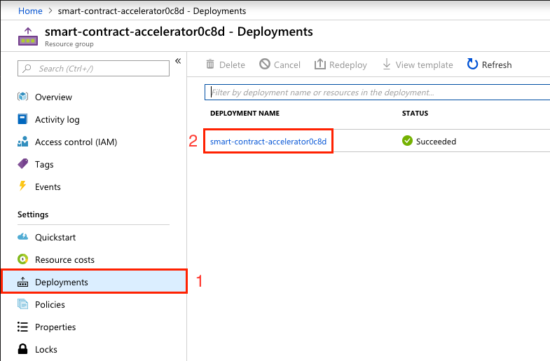

# To deploy on Azure

Prerequisites
=============
Azure cloud account is mandatory to deploy this smart contract accelerator. Refer the below link to create an azure account 

https://azure.microsoft.com/en-us/free/

Steps to deploy smart contract accelerator
==========================================

1. Click the below button, it will open "Deploy to Azure" screen to initiate the deployment

     

    Click the below link to visualize the azure components

    

2. Provide values for the following highligted mandatory fields and press <b>"Next"</b> to proceed further.
   
    <b>"Admin Username / Admin Password" </b> - Credentials to access virtual machine.
    
    <b> "Dns Name for Public IP" </b> - Unique name to access the admin panel 
    (ex http://<b>testbcnw</b>.eastus.cloudapp.azure.com:8090/login) 

    

3. "Preview" screen will show the list of azure resources will be created during the deployment. For this accelerator the following resources will be created. Press <b>"Deploy"</b> to start the deployment process.
    * Microsoft.Network
    * Microsoft.Compute

    

4. The following componenets will be deployed on azure. After successful deployment, link will be provided to access the azure portal. Deployment will take 5 to 8 minutes to complete.
    * Updating Microsoft.Network/publicIPAddresses
    * Updating Microsoft.Network/virtualNetworks
    * Updating Microsoft.Network/networkInterfaces
    * Updating Microsoft.Compute/virtualMachines
    * Updating Microsoft.Compute/virtualMachines/extensions 

    

5. Click <b>"Manage"</b> link to access deployed resources from azure portal.

6. In azure portal, under <b>"Settings"</b>, select <b>"Deployments"</b> then select the name under the column header <b>"DEPLOYMENT NAME"</b>. This will open deployment overview screen.

    

7. In deployment overview screen, select "Output" and copy the URL from "ApplicationURL" field. Paste the URL on browser address bar to access admin panel.

